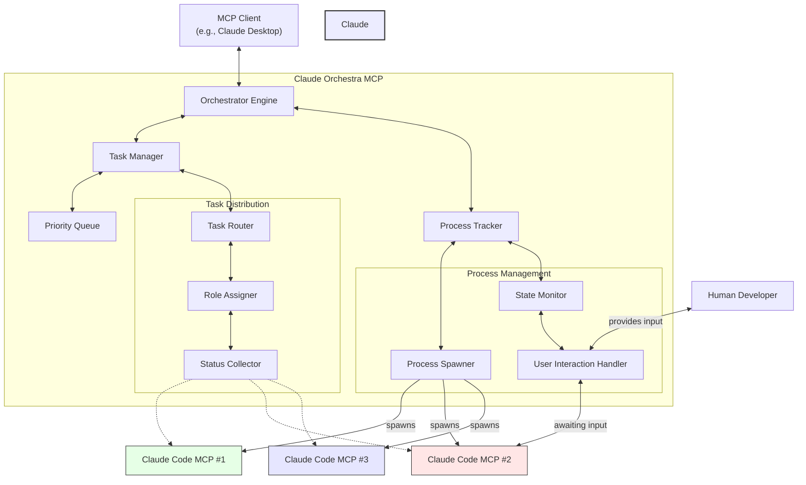

# Claude Code Orchestrator MCP [Work in Progress]

> ⚠️ **IMPORTANT**: This package is currently under development and not yet ready for production use. The current version is a work in progress and may contain incomplete features or breaking changes.

An MCP server that orchestrates multiple Claude Code instances as a collaborative AI development team. This orchestrator enables role-based specialization, parallel execution, and dependency-based workflows.

## Architecture



## Features

### Multi-Agent Development Team

The Claude Code Orchestrator creates a powerful development environment by managing multiple Claude Code instances, each with specialized roles:

- **Architect**: Designs system architecture and high-level designs
- **Implementer**: Implements code and functionality
- **Tester**: Creates and runs tests to ensure code quality
- **Reviewer**: Reviews code for quality and best practices
- **DevOps**: Sets up build, deployment, and infrastructure
- **Documenter**: Creates documentation for code and systems
- **Generalist**: Performs all types of development tasks

### Workflow Orchestration

The orchestrator provides powerful workflow management capabilities:

- **Task Queuing**: Submit tasks and have them executed when resources are available
- **Priority Management**: Assign priorities to tasks to control execution order
- **Dependency Management**: Specify task dependencies to ensure proper execution flow
- **Predefined Workflows**: Use templates for common development workflows
- **Parallel Execution**: Execute multiple tasks simultaneously
- **Process Monitoring**: Track process status and output

### Process Management

Robust process management features for reliable operation:

- **Process Tracking**: Track process status, runtime, and output
- **Timeout Detection**: Automatically detect and handle process timeouts
- **Interactive Processes**: Send input to processes that are waiting for user interaction
- **Resource Limits**: Control maximum number of concurrent processes
- **Process Cleanup**: Automatically clean up completed and failed processes

## Available Tools

1. **submit-task**: Submit a new development task with role specification
2. **list-processes**: View all active processes with status
3. **process-details**: Get detailed information about a specific process
4. **respond-to-process**: Send input to a waiting process
5. **manage-queue**: List, prioritize, or remove queued tasks
6. **stop-process**: Stop a running process
7. **configure-orchestrator**: Configure orchestrator settings
8. **assign-role**: Assign a specific role to a process
9. **create-workflow**: Create a multi-agent workflow from template
10. **status-dashboard**: Get visual status of all processes

## Available Resources

1. **orchestration-status**: Detailed status of the orchestrator
2. **process-logs**: Logs for specific processes
3. **role-definitions**: Available agent role definitions
4. **workflow-templates**: Available workflow templates

## Workflow Templates

The orchestrator comes with predefined workflow templates for common development tasks:

1. **Code Review**: Comprehensive code review workflow
2. **Feature Development**: End-to-end feature development workflow
3. **Bug Fix**: Workflow for fixing and verifying bugs
4. **Code Refactoring**: Workflow for code refactoring with safety checks

## Installation

### Prerequisites

- Node.js 18+ installed
- Claude Code MCP installed and configured
- MCP client (e.g., Claude Desktop)

### Installation Steps

```bash
# Install the package
npm install @devlimelabs/claude-code-orchestrator-mcp

# Start the server
npx claude-code-orchestrator-mcp
```

### Configuration with Claude Desktop

Edit your `~/Library/Application Support/Claude/claude_desktop_config.json` to include:

```json
{
  "mcpServers": {
    "claude-code-orchestrator": {
      "command": "npx",
      "args": ["claude-code-orchestrator-mcp"]
    }
  }
}
```

Then restart Claude Desktop to connect to the MCP server.

## Example Usage

### Submitting a Task

```
Can you please submit a task to implement a new feature for calculating prime numbers efficiently?
```

### Creating a Workflow

```
Can you create a feature development workflow for adding user authentication to my application?
```

### Managing Processes

```
Can you list all running processes and show me if any are waiting for input?
```

## Development

### Building from Source

```bash
# Clone the repository
git clone https://github.com/your-repo/master-mcps.git
cd master-mcps

# Install dependencies
pnpm install

# Build the package
pnpm -F @devlimelabs/claude-code-orchestrator-mcp build

# Link for local development
cd packages/claude-code-orchestrator
npm link
```

### Running Tests

```bash
pnpm -F @devlimelabs/claude-code-orchestrator-mcp test
```

## License

MIT